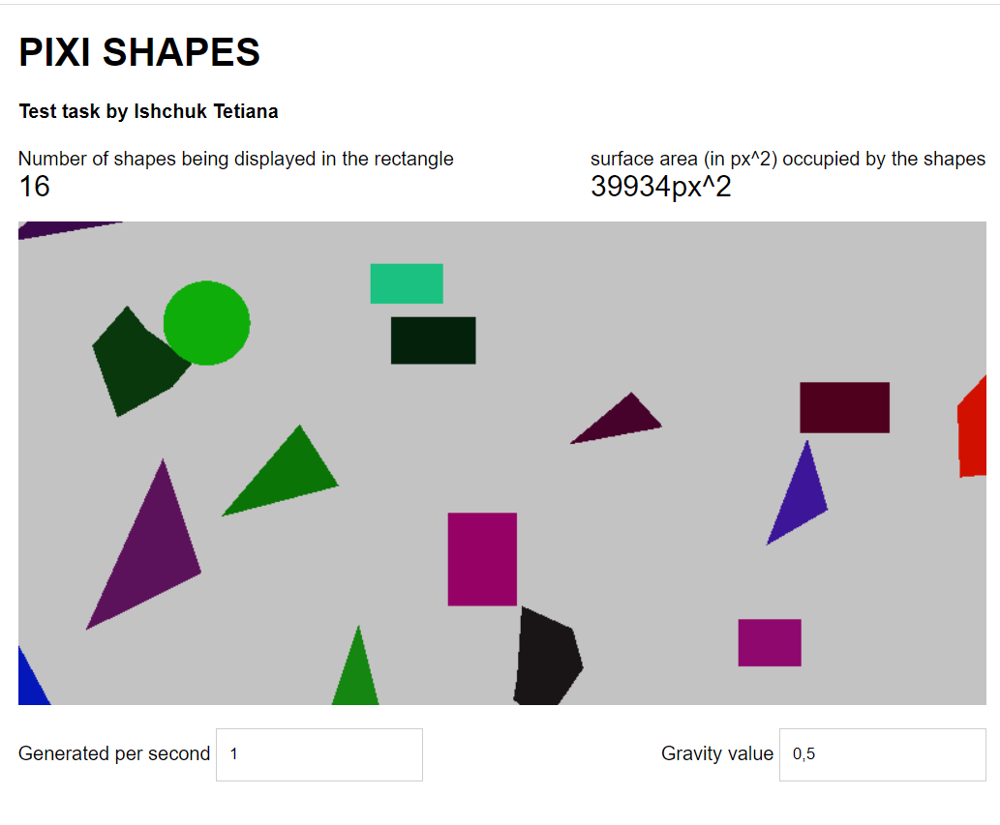

  
  <h1>SHAPES GAME</h1>
  

    Test task
  

[DEMO LINK](https://ishchuk-r.github.io/Pixi-shapes/)

## How to run it:
 1. Clone the repository `git clone git@github.com:Ishchuk-R/Pixi-shapes.git`
 2. Go into project folder `cd Pixi-shapes`
 3. Run `npm install`
 4. Run `npm start` 
 5. Open in your Browser 

